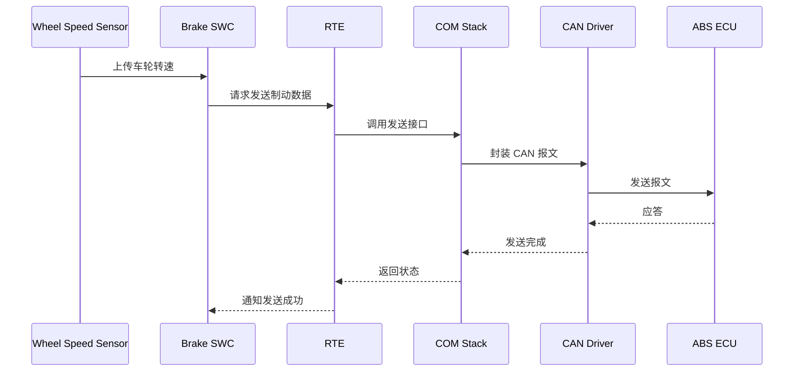
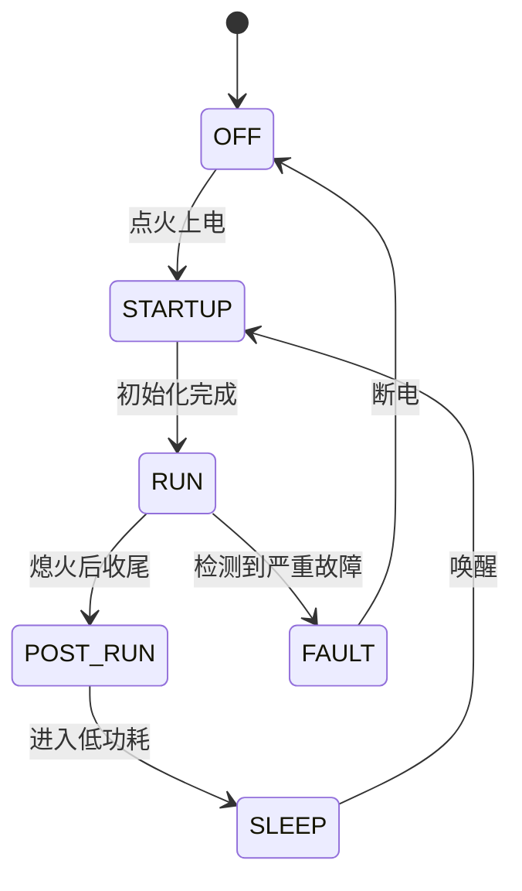
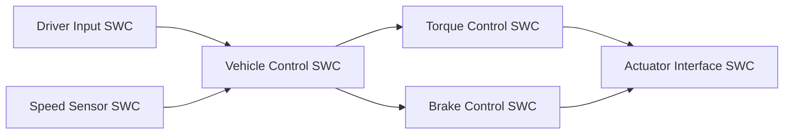
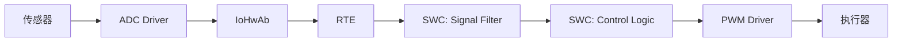
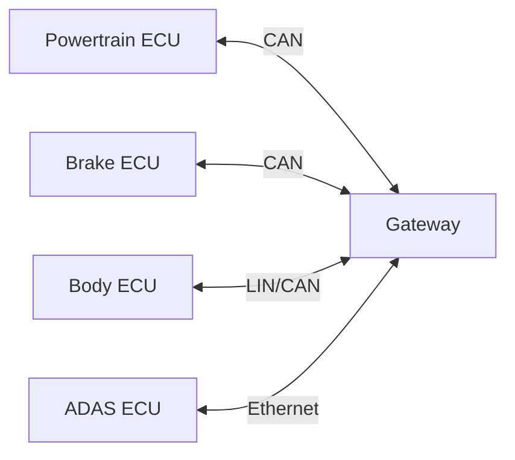
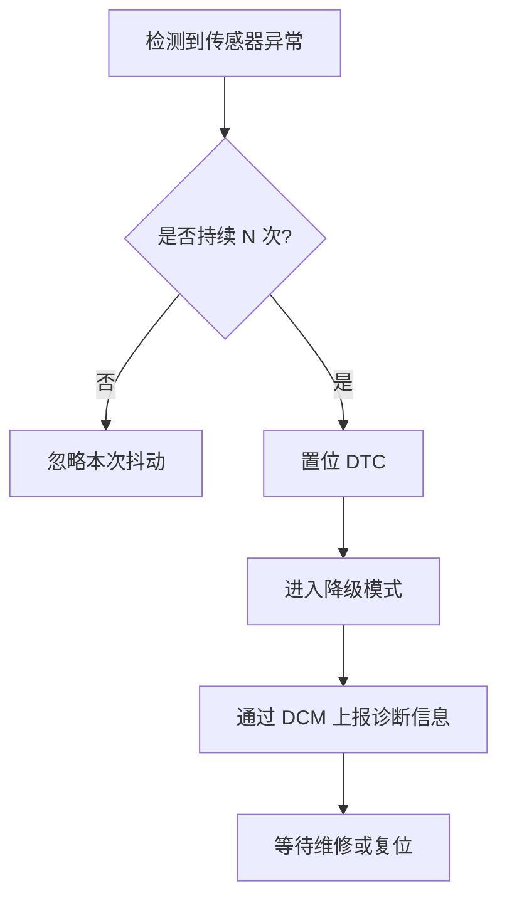
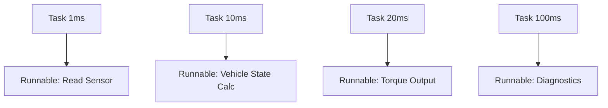

下面给你一份可直接复制的 **Markdown**，里面包含几种 **超常用 Mermaid 图表类型**，内容都围绕 **车载 AUTOSAR** 来写。

````md
# Mermaid 常用图表示例（AUTOSAR 车载场景）

## 1. 流程图 Flowchart
适合画：
- ECU 启动流程
- 软件初始化流程
- 功能处理流程

```mermaid
flowchart TD
    A[ECU 上电] --> B[MCAL 初始化]
    B --> C[BSW 初始化]
    C --> D[OS 启动]
    D --> E[RTE 初始化]
    E --> F[应用层 SWC 启动]
    F --> G[读取传感器信号]
    G --> H[执行控制算法]
    H --> I[输出执行器控制命令]
````

---

## 2. 分层架构图

适合画：

* AUTOSAR Classic 分层
* SWC / RTE / BSW 关系

```mermaid
flowchart TB
    subgraph Application_Layer[Application Layer]
        SWC1[SWC: Engine Control]
        SWC2[SWC: Brake Control]
        SWC3[SWC: Vehicle State Manager]
    end

    subgraph RTE_Layer[RTE]
        RTE[RTE Runtime Environment]
    end

    subgraph BSW_Layer[Basic Software]
        COM[COM Stack]
        DCM[DCM]
        NVM[NvM]
        OS[OS]
        MCAL[MCAL Drivers]
    end

    SWC1 --> RTE
    SWC2 --> RTE
    SWC3 --> RTE
    RTE --> COM
    RTE --> DCM
    RTE --> NVM
    COM --> OS
    DCM --> OS
    NVM --> MCAL
    OS --> MCAL
```

---

## 3. 时序图 Sequence Diagram

适合画：

* ECU 间通信
* RTE 调用过程
* CAN / SOME/IP 报文交互



---

## 4. 状态图 State Diagram

适合画：

* ECU 工作模式
* 电源模式
* BswM / EcuM 状态切换



---

## 5. 组件关系图

适合画：

* SWC 依赖关系
* 接口调用关系
* 功能模块拆分



---

## 6. 数据流图

适合画：

* 信号流转
* 传感器到执行器的数据路径
* ECU 内部处理链路



---

## 7. ECU 网络拓扑图

适合画：

* 整车 ECU 分布
* CAN / LIN / Ethernet 网络关系



---

## 8. 故障处理流程图

适合画：

* DTC 处理流程
* 诊断逻辑
* 故障降级逻辑



---

## 9. 任务调度示意图

适合画：

* OS Task 调度
* 周期任务
* Runnable 分配关系



---

## 10. AUTOSAR 通信路径图

适合画：

* Sender/Receiver
* Client/Server
* COM 到总线驱动路径


---

# 推荐优先掌握的 4 类

如果你最常用的是 AUTOSAR 文档，建议优先掌握这 4 类：

1. Flowchart
2. Sequence Diagram
3. State Diagram
4. 分层架构图（flowchart + subgraph）

---

# 备注

如果你后面要写更贴近工程的内容，还可以继续扩展这些场景：

* EcuM 启动与休眠
* BswM 模式管理
* COM 信号打包与解包
* DCM 诊断服务处理
* NvM 数据保存流程
* SOME/IP 服务发现与调用

```

如果你要，我还可以继续给你一版 **更贴近实际项目文档风格** 的，比如专门整理成：
**EcuM / BswM / COM / DCM / NvM / RTE / OS** 七大 AUTOSAR 高频模板。
```
